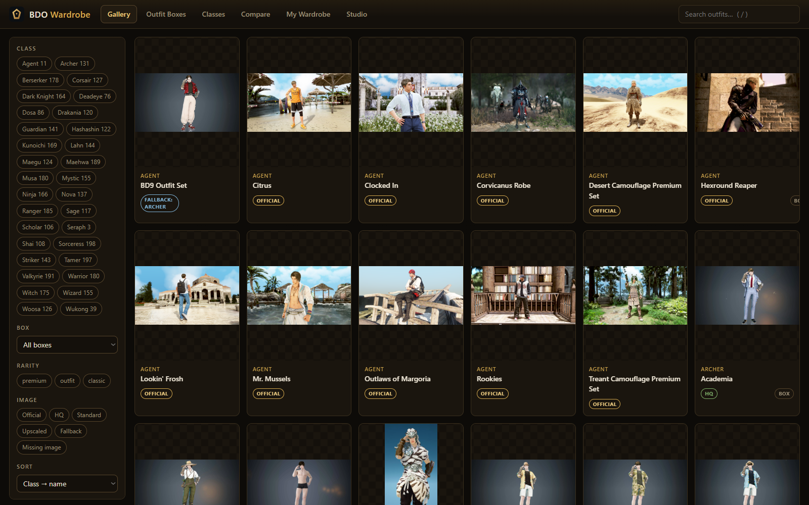
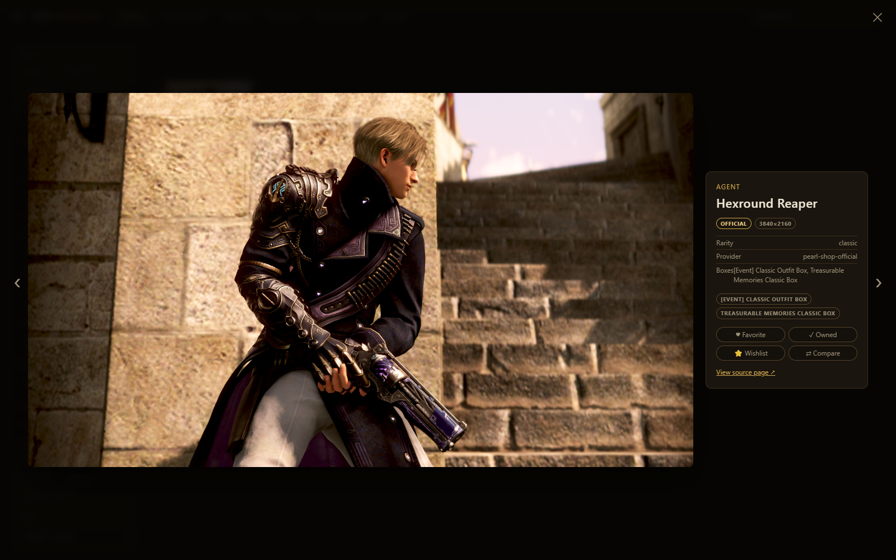
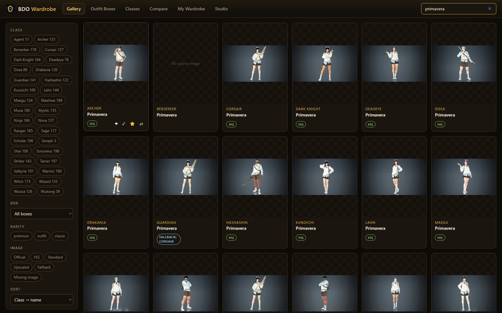

# BDO Wardrobe

**A gallery-first outfit viewer for Black Desert Online.** Browse **4,343 outfits across 32 classes and 11 outfit boxes**, with honest image-quality badges, instant search, favorites/owned/wishlist tracking, outfit-box value views, side-by-side comparison, and a shareable wardrobe export.



## Highlights

- **4,343 outfits** — the full Pearl Shop catalog: every class, every box, including the Agent class launch roster
- **Honest badges, never faked** — every preview is labeled by what it actually is: `Official` / `HQ` / `Standard` / `Upscaled` / `Fallback` / `Missing`, derived from measured pixel dimensions + provenance
- **Sibling fallbacks that admit it** — if a class has no render for an outfit (and one exists in-game), the app borrows the closest gender-matched sibling render and labels it `FALLBACK: <Class>`. Berserker and Shai never borrow or lend — their frames would misrepresent any outfit
- **Instant search & filters** — debounced full-text search over 4,343 cards; filter by class, box, rarity, and image quality
- **Lightbox with metadata** — rarity, provider, source page link, outfit boxes, resolution
- **My Wardrobe** — mark outfits *Favorite / Owned / Wishlist*, persisted locally; export/import your collection as JSON
- **Compare view** — put two outfits side by side
- **Zero dependencies** — plain Node ≥ 18 + vanilla JS. No npm install. Ever.



*Every card tells the truth about its own picture — including borrowed ones.*



## Quick start

```bash
node server.mjs
# → http://127.0.0.1:7861
```

That's it. No build step, no dependencies.

**Windows desktop flavor:** double-click `BDO Wardrobe.exe`. The launcher
(`resources/launcher.ps1`) provisions a private Node runtime (SHA256-verified)
and WebView2 shell into `%LOCALAPPDATA%\BDO Wardrobe`, so it never touches your
system Node.

## How images work

Previews live in `public/assets/images/` and are indexed by
`data/images.json` (`{id → file, width, height, provider, sourceUrl}`). The
catalog is `data/catalog.json` (4,343 outfits). Both ship in the repo so the
app works offline out of the box.

Quality tiers are computed from **measured facts only**:

| Tier | Meaning |
|---|---|
| `Official` | Pearl Abyss' own product render |
| `HQ` | Measured ≥ 500px on the short side |
| `Standard` | Smaller than HQ but real |
| `Upscaled` | Enlarged from a tiny native thumbnail (blurry at full size) |
| `Fallback` | Borrowed from a gender-matched sibling class |
| `Missing` | No verified image exists yet |

The crawler scripts in `scripts/` can re-fetch/expand the catalog from public
sources (mmo-fashion, Altar of Gaming) — see `scripts/*.mjs` headers. They are
development tools; the shipped catalog already covers everything they found.

## Repository layout

```
resources/
├── server.mjs              # static + API server (zero-dep)
├── launcher.ps1            # Windows desktop bootstrap (private runtime)
├── public/                 # UI (vanilla JS) + 4,339 previews
├── data/
│   ├── catalog.json        # 4,343 outfits / 11 boxes
│   └── images.json         # image index + quality metadata
├── lib/                    # fetch/matching helpers used by crawler scripts
└── scripts/                # catalog builder, crawler, E2E verify harness
```

## Verification

`scripts/verify.mjs` is a Playwright end-to-end suite (13 checks: boot counts,
search, filters, lightbox navigation, favorites persistence, badge honesty,
fallback labels…). It expects the server running on `127.0.0.1:7861`.

```bash
node server.mjs &
npm ci && npx playwright install chromium   # CI does this automatically
node scripts/verify.mjs
```

CI runs the suite on every push and pull request.

## Data sources & credits

Outfit data compiled from public community sources:
[mmo-fashion.com](https://mmo-fashion.com) and
[altarofgaming.com](https://altarofgaming.com), plus official Pearl Shop
announcement renders. All outfit names/descriptions and Black Desert Online are
© **Pearl Abyss Corp.** This is an unofficial fan tool; no game assets are
redistributed — previews are screenshots/renders as permitted by Pearl Abyss'
fan-content policy.

## License

Code: MIT — see [LICENSE](LICENSE).
